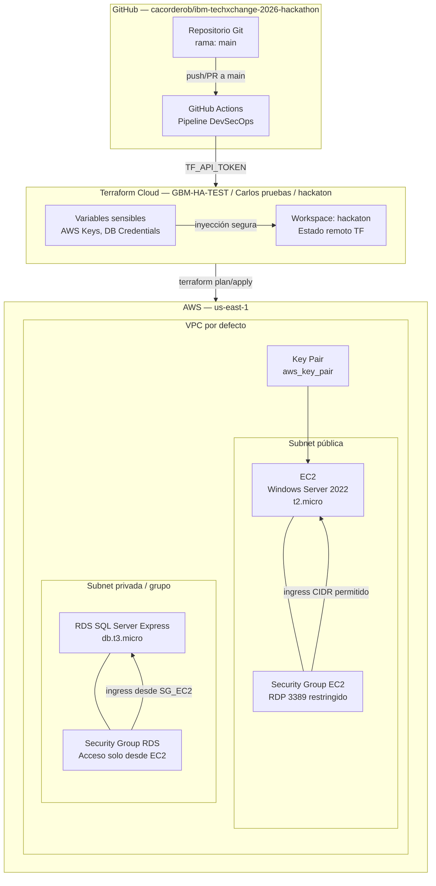
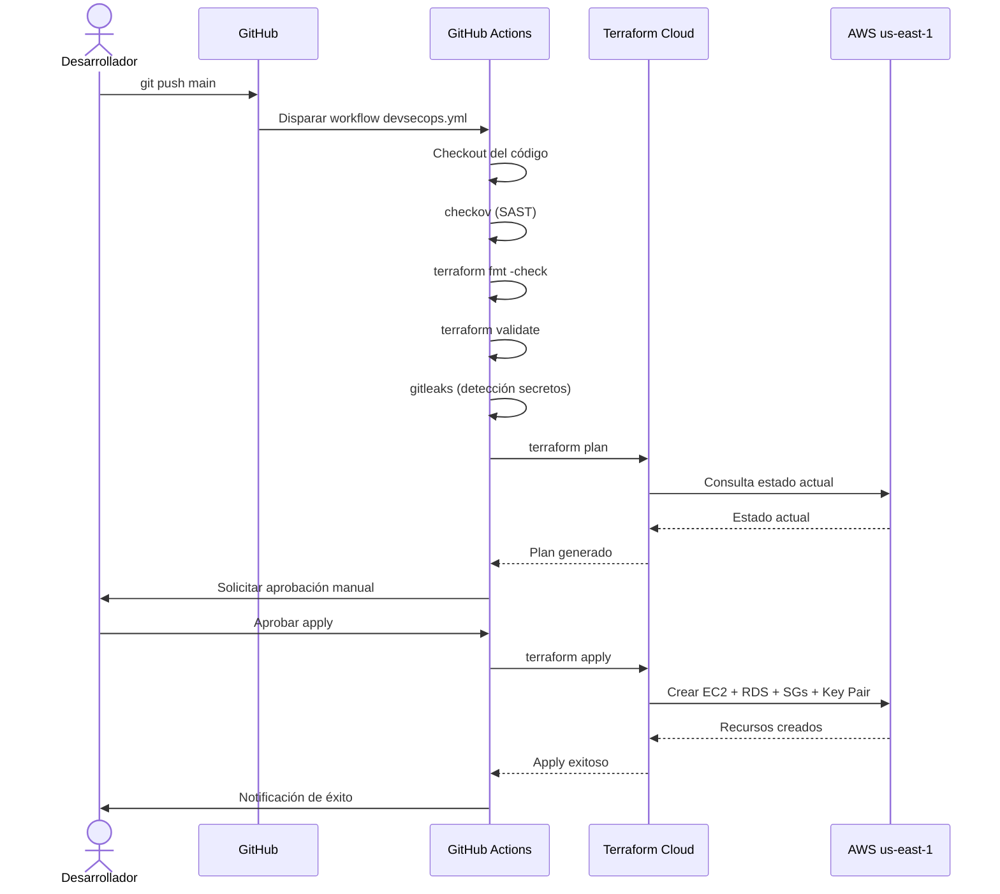

# Arquitectura de Infraestructura

## Diagrama de arquitectura

## Descripción de componentes

### GitHub Actions (Pipeline DevSecOps)
- Disparado por `push` y `pull_request` a la rama `main`
- Ejecuta análisis de seguridad, validación de código Terraform y detección de secretos
- Requiere aprobación manual antes del apply
- Se autentica con Terraform Cloud mediante `TF_API_TOKEN`

### Terraform Cloud
- **Organización:** `GBM-HA-TEST`
- **Proyecto:** `Carlos pruebas`
- **Workspace:** `hackaton`
- Almacena el estado remoto de Terraform de forma segura
- Gestiona todas las variables sensibles (credenciales AWS, contraseñas DB)
- Conectado al VCS Provider del repositorio GitHub

### EC2 — Windows Server 2022

| Atributo | Valor |
|----------|-------|
| Sistema operativo | Windows Server 2022 |
| Tipo de instancia | `t2.micro` |
| Región | `us-east-1` |
| AMI | Dinámica (última disponible de `amazon`) |
| IP pública | Asignada dinámicamente por AWS al aprovisionar |
| Key pair | Creado por Terraform (`aws_key_pair`) |
| Security Group | RDP (3389) restringido al CIDR configurado |

### RDS — SQL Server Express

| Atributo | Valor |
|----------|-------|
| Motor | `sqlserver-ex` (SQL Server Express) |
| Versión | `15.00` (SQL Server 2019) |
| Tipo de instancia | `db.t3.micro` |
| Región | `us-east-1` |
| Multi-AZ | Deshabilitado (entorno de prueba) |
| Licencia | `license-included` |
| Snapshot final | Deshabilitado (`skip_final_snapshot = true`) |
| Security Group | Acceso restringido al Security Group de EC2 |

### Security Groups

#### SG-EC2 (ec2-windows-sg)
| Tipo | Protocolo | Puerto | Origen |
|------|-----------|--------|--------|
| Ingress | TCP | 3389 (RDP) | CIDR configurado en variable |
| Egress | All | All | `0.0.0.0/0` |

#### SG-RDS (rds-sqlserver-sg)
| Tipo | Protocolo | Puerto | Origen |
|------|-----------|--------|--------|
| Ingress | TCP | 1433 (SQL Server) | Security Group de EC2 |
| Egress | All | All | `0.0.0.0/0` |

## Flujo de aprovisionamiento

## Consideraciones de red

- Se utiliza la **VPC por defecto** de AWS en `us-east-1` para simplicidad del entorno de hackathon
- La EC2 recibe una IP pública dinámica asignada por AWS
- La RDS se ubica en un DB Subnet Group que abarca múltiples zonas de disponibilidad
- La comunicación entre EC2 y RDS se restringe mediante Security Groups (no IP hardcodeada)

## Consideraciones de seguridad

- Las credenciales AWS nunca están en el código; se inyectan desde Terraform Cloud (variables de entorno)
- La contraseña de la base de datos es una variable `sensitive = true` en Terraform Cloud
- El RDP (3389) no está abierto a `0.0.0.0/0`; se restringe al CIDR configurado por variable
- El puerto de SQL Server (1433) solo es accesible desde el Security Group de la EC2
- El pipeline verifica la ausencia de secretos expuestos con `gitleaks` antes de ejecutar cualquier apply
